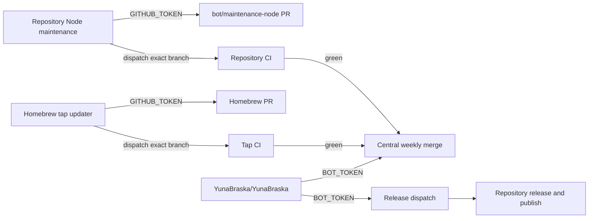

# Automation ownership

`YunaBraska/YunaBraska` owns organisation-wide scheduling. `BOT_TOKEN` merges
the green maintenance pull requests it discovers in other repositories.



| Work | Runs in | Writer | Reason |
| --- | --- | --- | --- |
| Update Node dependencies | Source repository | Its scoped `GITHUB_TOKEN` | It rebuilds and tests that repository's `dist`, opens or recovers `bot/maintenance-node`, then dispatches its exact branch to `build-pr.yml`. |
| Merge green Dependabot and maintenance PRs | `YunaBraska/YunaBraska` | `BOT_TOKEN` | One authority across the organisation. |
| Dispatch releases | `YunaBraska/YunaBraska` | `BOT_TOKEN` | Discovery and scheduling are central. |
| Create tags, GitHub releases, packages, and Central coordinates | Source repository | Its scoped `GITHUB_TOKEN` | The release owns its own artifacts. |
| Update Homebrew casks and formulae | `YunaBraska/homebrew-tap` | Its `GITHUB_TOKEN` | The updater and tap are the same repository. |
| Validate a Homebrew PR | `YunaBraska/homebrew-tap` | Its `GITHUB_TOKEN` | The updater dispatches the formula workflow for its exact commit. |

Node maintenance follows the same explicit-check pattern as Maven Wrapper and Homebrew: GitHub may suppress the automatic pull-request event created by `GITHUB_TOKEN`, so it dispatches the repository's existing `🧪 CI · Pull Request` for the exact maintenance branch. These maintenance jobs grant `actions: write` only for that dispatch; they never start a release or publish artifacts. Central weekly maintenance merges only after the check is green.

The tap updater runs daily at 20:00 UTC, supports manual dry runs, updates only
declared stable release assets, and opens one `bot/maintenance-homebrew` PR.
It then dispatches `🍺 CI · Formula` for that exact branch commit. GitHub can
mark the automatic pull-request run created by `GITHUB_TOKEN` as `UNKNOWN` or
`UNSTABLE`; Monday maintenance instead recognizes that successful explicit
formula run before it merges. The updater does not wait for CI.

The central `BOT_TOKEN` uses its existing Contents write access to merge the
green Homebrew PR on Monday. It is never used to create Homebrew branches or
PRs, and no tap secret is needed.

## Homebrew decision — Done

Keep `🍺 CD · Update` in `YunaBraska/homebrew-tap`. Never centralize this
writer or give the tap a `BOT_TOKEN`.

- The marker comments, changed Casks/formulae, branch, and PR all belong to the
  tap, so its scoped `GITHUB_TOKEN` is sufficient.
- The updater explicitly dispatches `🍺 CI · Formula` for the new commit. That
  run—not GitHub's approval-gated automatic pull-request event—is the merge
  gate.
- Central weekly maintenance discovers the green `bot/maintenance-homebrew` PR
  and merges it. It does not update Homebrew files or wait for formula CI.

This was proven by the [tap update](https://github.com/YunaBraska/homebrew-tap/actions/runs/31743370326), its [formula run](https://github.com/YunaBraska/homebrew-tap/actions/runs/31743414534), and the [central dry run](https://github.com/YunaBraska/YunaBraska/actions/runs/31744529948).

## Homebrew asset contract

Each Cask or formula declares the release and every downloaded asset:

```rb
# yuna-release: YunaBraska/example
# yuna-release-asset: Example-{version}.zip
```

The tap updater downloads each asset, verifies the SHA-256 it writes, runs
`brew style`, and changes nothing when all declarations already match the latest
stable release. The Cask or formula itself selects operating systems and CPU
architectures with Homebrew's normal conditions.

## Audit boundary

Central release discovery, upstream maintenance, and weekly merging follow this
model. Homebrew, Maven Wrapper, and Node dependency maintenance intentionally
open their own narrow pull requests with `GITHUB_TOKEN`; their repositories must
enable **Allow GitHub Actions to create and approve pull requests**. Node
maintenance runs at 06:00 UTC Sunday, central merges green PRs at 06:00 UTC
Monday, and the release dispatcher runs at 16:00 UTC Monday.

Every scheduled workflow supports a manual dry run. A dry run may read, build,
test, style, and print its intended mutation; it never creates a branch, pull
request, tag, release, deployment, or package.

Upstream maintenance maps the existing central `GH_TOKEN` only to Maven's
`github` server. Project tests never receive `GITHUB_TOKEN`, so tests that query
public GitHub APIs use anonymous access while Maven can resolve private packages.
