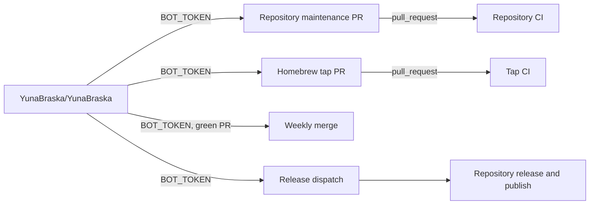

# Automation ownership

`YunaBraska/YunaBraska` owns organisation-wide automation. Its `BOT_TOKEN` is
the only credential that creates or merges maintenance pull requests in another
repository.



| Work | Runs in | Writer | Reason |
| --- | --- | --- | --- |
| Merge green Dependabot and maintenance PRs | `YunaBraska/YunaBraska` | `BOT_TOKEN` | One authority across the organisation. |
| Dispatch releases | `YunaBraska/YunaBraska` | `BOT_TOKEN` | Discovery and scheduling are central. |
| Create tags, GitHub releases, packages, and Central coordinates | Source repository | Its scoped `GITHUB_TOKEN` | The release owns its own artifacts. |
| Update Homebrew casks and formulae | `YunaBraska/YunaBraska` | `BOT_TOKEN` | The tap is a different repository. The resulting PR must trigger normal tap CI. |
| Validate a Homebrew PR | `YunaBraska/homebrew-tap` | Read-only `GITHUB_TOKEN` | Validation never writes. |

`GITHUB_TOKEN` is repository-scoped. It cannot safely write to another
repository, and a PR it creates can require workflow approval. Therefore the
tap has no write scheduler and no `BOT_TOKEN` secret. The central Homebrew job
runs daily at 20:00 UTC, supports manual dry runs, updates only declared stable
release assets, and opens one `bot/maintenance-homebrew` PR. It does not wait
for CI; Monday maintenance merges that PR only after the tap's normal PR check
is green.

The central fine-grained token needs `Contents` and `Pull requests` read/write
for every repository it maintains. `Actions` read/write is also required where
central automation dispatches another repository's workflow. The Homebrew job
uses the first two permissions for `YunaBraska/homebrew-tap`; no token is stored
in that repository. If PR creation fails after creating a new maintenance
branch, the job deletes that branch before failing.

## Homebrew asset contract

Each Cask or formula declares the release and every downloaded asset:

```rb
# yuna-release: YunaBraska/example
# yuna-release-asset: Example-{version}.zip
```

The central updater downloads each asset, verifies the SHA-256 it writes, runs
`brew style`, and changes nothing when all declarations already match the latest
stable release. The Cask or formula itself selects operating systems and CPU
architectures with Homebrew's normal conditions.

## Audit boundary

Central release discovery, upstream maintenance, weekly merging, and Homebrew
now follow this model. The legacy Maven Wrapper and Node dependency reusables
still write from their caller repositories with `GITHUB_TOKEN`; do not copy
that pattern. They are the remaining centralisation migration because they can
have the same approval-gated PR behaviour that Homebrew had.
