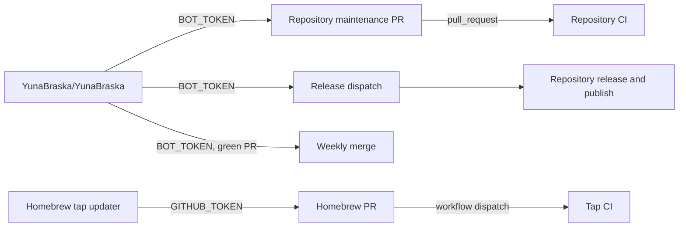

# Automation ownership

`YunaBraska/YunaBraska` owns organisation-wide scheduling. `BOT_TOKEN` merges
the green maintenance pull requests it discovers in other repositories.



| Work | Runs in | Writer | Reason |
| --- | --- | --- | --- |
| Merge green Dependabot and maintenance PRs | `YunaBraska/YunaBraska` | `BOT_TOKEN` | One authority across the organisation. |
| Dispatch releases | `YunaBraska/YunaBraska` | `BOT_TOKEN` | Discovery and scheduling are central. |
| Create tags, GitHub releases, packages, and Central coordinates | Source repository | Its scoped `GITHUB_TOKEN` | The release owns its own artifacts. |
| Update Homebrew casks and formulae | `YunaBraska/homebrew-tap` | Its `GITHUB_TOKEN` | The updater and tap are the same repository. |
| Validate a Homebrew PR | `YunaBraska/homebrew-tap` | Its `GITHUB_TOKEN` | The updater dispatches the formula workflow for its exact commit. |

The tap updater runs daily at 20:00 UTC, supports manual dry runs, updates only
declared stable release assets, and opens one `bot/maintenance-homebrew` PR.
It then dispatches `🍺 CI · Formula` for that exact branch commit. GitHub can
mark the automatic pull-request run created by `GITHUB_TOKEN` as `UNKNOWN` or
`UNSTABLE`; Monday maintenance instead recognizes that successful explicit
formula run before it merges. The updater does not wait for CI.

The central `BOT_TOKEN` uses its existing Contents write access to merge the
green Homebrew PR on Monday. It is never used to create Homebrew branches or
PRs, and no tap secret is needed.

## Homebrew asset contract

Each Cask or formula declares the release and every downloaded asset:

```rb
# yuna-release: YunaBraska/example
# yuna-release-asset: Example-{version}.zip
```

The tap updater downloads each asset, verifies the SHA-256 it writes, runs
`brew style`, and changes nothing when all declarations already match the latest
stable release. The Cask or formula itself selects operating systems and CPU
architectures with Homebrew's normal conditions.

## Audit boundary

Central release discovery, upstream maintenance, and weekly merging follow this
model. Homebrew intentionally writes locally from the tap. The legacy Maven
Wrapper and Node dependency reusables still write from their caller repositories
with `GITHUB_TOKEN`; do not copy that pattern. They are the remaining
centralisation migration because they can have the same approval-gated PR
behaviour that Homebrew has explicitly handled.

Every scheduled workflow supports a manual dry run. A dry run may read, build,
test, style, and print its intended mutation; it never creates a branch, pull
request, tag, release, deployment, or package.

Upstream maintenance maps the existing central `GH_TOKEN` only to Maven's
`github` server. Project tests never receive `GITHUB_TOKEN`, so tests that query
public GitHub APIs use anonymous access while Maven can resolve private packages.
