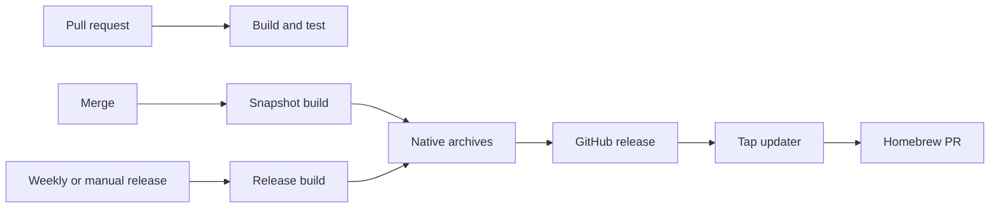

# .NET CI/CD



| Trigger | Version | Result |
| --- | --- | --- |
| Pull request | `next_snapshot` from the latest tag, fallback `0.0.1` | Build and test only. |
| Merge | Same | Build all native archives; retain them for one day. |
| Weekly release with source changes | UTC `YYYY.M.D` | Tag, GitHub release, archives, and `SHA256SUMS`. |
| Manual release | Same; `force` permits unchanged source | Same. |

The latest tag is the newest reachable tag by creation time. Release detection ignores documentation, tests, examples, and `.github`; every other tracked source change releases. A version with a hyphen is a GitHub pre-release.

## Conventions

`global.json` selects the SDK. `scripts/test.sh`, when present, is the test entrypoint; otherwise the workflow runs `dotnet test`. It passes the resolved version in `VERSION`.

Native archives use `scripts/publish.sh <rid>` when present. It must write `out/<repository>-<asset>`. Without that script, the workflow publishes the first executable project it finds. A `scripts/build-macos-app.sh <rid>` script creates a `.app` ZIP for macOS; otherwise macOS is a normal ZIP. No workflow input selects a project, profile, Dockerfile, or assets.

| Assets | Runner | Reason |
| --- | --- | --- |
| Linux x64, ARM64, ARM, musl x64, musl ARM64, musl ARM | Ubuntu x64 | .NET publishes these targets without executing their binaries. |
| Windows x64, x86, ARM64 | Ubuntu x64 | Cross-published; no emulator. |
| macOS ARM64 | macOS ARM64 | Builds the real app bundle. |
| macOS x64 | macOS Intel | Builds the real app bundle. |

There is no QEMU: every native binary is built on a compatible hosted runner or cross-published without execution. The matrix has `fail-fast: false`, so every platform reports its own result.

## Reuse

```yaml
# build-pr.yml
permissions:
  contents: read

jobs:
  build:
    uses: YunaBraska/YunaBraska/.github/workflows/wc_dotnet_build_common.yml@<FULL_COMMIT_SHA>
    with:
      ref: ${{ github.event.pull_request.head.sha }}
```

```yaml
# build-merge.yml
permissions:
  contents: read

jobs:
  build:
    uses: YunaBraska/YunaBraska/.github/workflows/wc_dotnet_build_common.yml@<FULL_COMMIT_SHA>
    with:
      ref: ${{ github.sha }}
      dry_run: true
  native:
    needs: build
    uses: YunaBraska/YunaBraska/.github/workflows/wc_dotnet_build_native.yml@<FULL_COMMIT_SHA>
    with:
      version: ${{ needs.build.outputs.version }}
```

```yaml
# release.yml
# yuna-release: true
permissions:
  actions: read
  contents: write

jobs:
  release:
    uses: YunaBraska/YunaBraska/.github/workflows/wc_dotnet_release.yml@<FULL_COMMIT_SHA>
    with:
      force: ${{ inputs.force }}
```

The app repository never writes Homebrew. Add the normal release and asset markers to the formula or cask; the tap daily updater opens one `bot/maintenance-homebrew` PR and weekly maintenance merges it when green. See [automation ownership](AUTOMATION.md).
