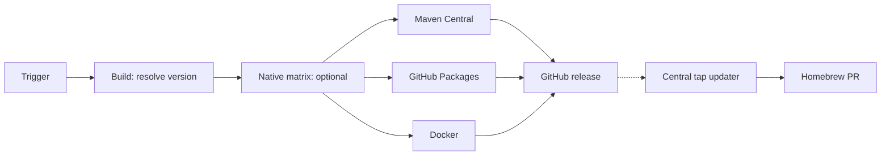

# Java CI/CD

Reusable Java workflows use POSIX `sh`. External calls use a full commit SHA; an internal call uses `./.github/workflows/` at the same commit.



Build resolves one version, writes it only to its workspace POM, and tests it. With `dry_run: true`, it resolves `next_snapshot`. It never reads `project.version` to decide a release. Date versions use UTC.

## POM migration baseline

- Use `<version>1.0.0</version>` and define `project.build.outputTimestamp`.
- Keep version properties in one block, grouped as project, test, and build.
- Set `maven-jar-plugin` `outputTimestamp` from that property; the build replaces it with the commit timestamp.
- Use `maven-compiler-plugin` `<release>`, not `<source>` / `<target>`.
- Attach source and Javadoc jars in the normal build.
- Keep profile `central` for GPG and `central-publishing-maven-plugin` `0.11.0`, with `autoPublish` and `waitUntil` set to `published`. Version `0.7.0` rejects Sonatype's `warnings` response field; waiting for `published` keeps tags and GitHub releases behind public Central coordinates.

## Migration

1. Create one CI-only PR from the POM baseline and the four standard workflows: pull request, snapshot, release, and maintenance.
2. Add Central and GitHub Packages. Add Homebrew, native, or Docker only when needed. Keep every provider call on the same full commit SHA.
3. Run the PR build, squash merge it, and verify the real snapshot jobs in Central and GitHub Packages. Native projects also verify their one-day matrix artifacts.
4. Dispatch one forced stable release only when a new UTC date version is available. Verify Central, Packages, tag, GitHub Release, JAR, sources, Javadocs, and every enabled native asset or image.

Replace `<FULL_COMMIT_SHA>` below with one full immutable commit SHA from `YunaBraska/YunaBraska`.

## Full GitHub + Maven release

Omit any publisher the repository does not use.

```yml
on:
  workflow_dispatch:
    inputs:
      maven_central:
        description: Maven Central.
        required: true
        default: true
        type: boolean
      github_packages:
        description: GitHub Packages.
        required: true
        default: true
        type: boolean
      force:
        description: Force.
        required: true
        default: false
        type: boolean

# yuna-release: true
name: 🏷️ CD · Release

jobs:
  release:
    permissions:
      contents: read
    uses: YunaBraska/YunaBraska/.github/workflows/wc_java_release.yml@<FULL_COMMIT_SHA>
    with:
      force: ${{ inputs.force }}
      dry_run: ${{ inputs.maven_central != true || inputs.github_packages != true }}

  central:
    needs: release
    if: ${{ always() && !cancelled() && needs.release.result == 'success' }}
    permissions:
      actions: read
      contents: read
      deployments: write
    uses: YunaBraska/YunaBraska/.github/workflows/wc_java_publish_central.yml@<FULL_COMMIT_SHA>
    secrets:
      CENTRAL_USER: ${{ secrets.CENTRAL_USER }}
      CENTRAL_PASS: ${{ secrets.CENTRAL_PASS }}
      GPG_SIGNING_KEY: ${{ secrets.GPG_SIGNING_KEY }}
      GPG_PASSPHRASE: ${{ secrets.GPG_PASSPHRASE }}

  packages:
    needs: release
    if: ${{ always() && !cancelled() && needs.release.result == 'success' }}
    permissions:
      actions: read
      contents: read
      deployments: write
      packages: write
    uses: YunaBraska/YunaBraska/.github/workflows/wc_java_publish_github_packages.yml@<FULL_COMMIT_SHA>

  github:
    needs: [release, central, packages]
    if: ${{ always() && !cancelled() && needs.release.outputs.dry_run == 'false' && !endsWith(needs.release.outputs.version, '-SNAPSHOT') && needs.release.result == 'success' && needs.central.result == 'success' && needs.packages.result == 'success' }}
    permissions:
      actions: read
      contents: write
    uses: YunaBraska/YunaBraska/.github/workflows/wc_java_create_github_release.yml@<FULL_COMMIT_SHA>
    with:
      commit_sha: ${{ needs.release.outputs.commit_sha }}
      version: ${{ needs.release.outputs.version }}

```

## Homebrew tap

The central Homebrew updater watches public stable GitHub releases; release
repositories and the tap need no Homebrew token. A Cask or formula declares one
source and one or more assets:

```rb
# yuna-release: YunaBraska/my-tool
# yuna-release-asset: my-tool-macos-arm64-{version}.native
url "..."
sha256 "..."
```

The formula's `on_macos`, `on_linux`, and CPU conditions define supported targets.
The updater downloads each declared asset, updates its version, URL, and SHA-256,
then opens one `bot/maintenance-homebrew` PR. See [automation ownership](AUTOMATION.md).

## Version resolution

| Source / Semver strategy | Version |
| --- | --- |
| no `upstream_repository` | UTC release date: `YYYY.M.D` |
| newer upstream release | Exact upstream version |
| `snapshot`, `rc`, `major`, `minor`, `patch` | Semver action’s matching `next_<strategy>` |

Common build defaults to `snapshot`. The Semver base is the latest tag or upstream version; with neither it is `0.0.1`.

The shared Java workflows configure Maven's GitHub Packages server with the scoped action token; Central preserves both server entries.

A date that is not newer than the latest canonical `YYYY.M.D` tag resolves `next_snapshot`; legacy timestamp tags do not participate in date versioning. An upstream repository is read directly from its latest GitHub release. A newer upstream release wins; otherwise the declared strategy applies. For example, `upstream_repository: nats-io/nats-streaming-server` with `semver_strategy: snapshot` resolves the next snapshot from the latest local tag.

Disabling an artifact publisher selects a dry run. Build resolves a snapshot; Central and GitHub Packages deploy that snapshot. An unchanged release or non-default branch also uses dry runs unless `force` is true. GitHub releases are real and created only for a new non-snapshot version. The central daily workflow opens a `bot/maintenance-homebrew` PR for a new public release; weekly maintenance merges it when green.

A GitHub version with a hyphen is a pre-release.

Weekly release discovery requires exactly one `# yuna-release: true` marker and a `workflow_dispatch` trigger with defaults. Maintenance merges green `dependabot/*` and `bot/maintenance-*` PRs on Monday morning; release dispatch checks release inputs on Monday evening. `# yuna-java-upstream: owner/repository` in one maintenance workflow lets the central job run Maven's updater, then open one tested `bot/maintenance-upstream` PR only when tracked files changed.

## Maven Wrapper

Dependabot does not support Maven Wrapper files. The workflow below is a legacy caller-owned writer. Do not add it to another repository: it is the remaining maintenance centralisation migration described in [automation ownership](AUTOMATION.md).

```yml
name: 🛠️ CI · Maintenance

on:
  schedule:
    - cron: '0 6 * * 0'
  workflow_dispatch:
    inputs:
      dry_run:
        description: Dry run.
        required: true
        default: true
        type: boolean

permissions: {}

jobs:
  maven_wrapper:
    permissions:
      actions: write
      contents: write
      pull-requests: write
    uses: YunaBraska/YunaBraska/.github/workflows/wc_java_update_maven_wrapper.yml@<FULL_COMMIT_SHA>
    with:
      dry_run: ${{ github.event_name == 'workflow_dispatch' && inputs.dry_run || false }}
```

## Building blocks

| Workflow | Purpose |
| --- | --- |
| `wc_java_build_common.yml` | Resolve, build, test, and optionally upload `build-workspace`; always checks out submodules, reads GitHub Packages, and supports Playwright. |
| `wc_java_release.yml` | Build and decide deploy versus dry run. Outputs `commit_sha`, `dry_run`, and `version`. |
| `wc_java_publish_central.yml` | Deploy the build workspace to Maven Central. |
| `wc_java_publish_github_packages.yml` | Deploy the build workspace to GitHub Packages. |
| `wc_java_create_github_release.yml` | Create/update a GitHub release and upload build plus `release-assets-*` assets. |
| `wc_java_build_native.yml` | Build five native assets on their target architecture; no QEMU. |
| `wc_java_publish_docker.yml` | Publish a multi-platform GHCR image from the Linux native assets; no native recompilation. |
| `wc_java_update_maven_wrapper.yml` | Update Maven Wrapper and open a maintenance PR. |

## Native

Native projects add `native` after the resolved Java build. Maven Central and GitHub Packages wait for it, so a native failure stops every publisher before publication. The native workflow always uses Maven profile `native` and `Dockerfile_Native`, then uploads each matrix file as `release-assets-*`. Snapshots keep those assets for one day; stable releases attach them to the GitHub release.

### Runner matrix

| Asset | Runner | Build route | Decision |
| --- | --- | --- | --- |
| Linux AMD64 | `ubuntu-latest` | `Dockerfile_Native` | Standard Linux target. |
| Linux ARM64 | `ubuntu-24.04-arm` | `Dockerfile_Native` | Native ARM runner; avoids QEMU. |
| macOS Intel | `macos-15-intel` | Maven `-Pnative` | Supports Intel Macs. |
| macOS Apple Silicon | `macos-latest` | Maven `-Pnative` | Supports Apple Silicon Macs. |
| Windows x64 | `windows-latest` | Maven `-Pnative` + MSVC | Supported Windows release target. |

The matrix has `fail-fast: false` so every platform reports its result. Linux still uses Buildx to run its project Dockerfile, but the target runner matches the image architecture and the workflow does not configure QEMU. Windows ARM64 is not enabled: its hosted runner remains preview and no current release needs that extra artifact.

For native projects, `central`, `packages`, and `docker` all need both `release` and `native`. The Docker caller must also grant `actions: read`; it downloads the current run's Linux assets.

```yml
  docker:
    needs: [release, native]
    permissions:
      actions: read
      contents: read
      packages: write
    uses: YunaBraska/YunaBraska/.github/workflows/wc_java_publish_docker.yml@<FULL_COMMIT_SHA>
    with:
      version: ${{ needs.release.outputs.version }}
```

Any workflow can add release files by uploading a `release-assets-*` artifact. A repository can also commit static files in `release-assets/`; the build workspace carries them to the GitHub release. No release input is needed.

```yml
with:
  name: release-assets-my-files
  path: release-assets/*
```

## Docker

Docker projects add `docker` after `native`. `wc_java_publish_docker.yml` downloads exactly one Linux AMD64 and one Linux ARM64 asset from the current run, creates a minimal architecture-selected image, and pushes `ghcr.io/<owner>/<repository>:<version>`. It does not check out source, run `Dockerfile_Native`, compile a native image, or configure QEMU. Buildx only assembles the two-image manifest from the already-built binaries.

This keeps Docker consistent with the GitHub release assets, removes the duplicate ARM64 compilation, and makes Docker publish independent of the Maven publishers once the native matrix succeeds. Versions with a hyphen—including snapshots—never move `latest`; a stable version also updates `latest`.
