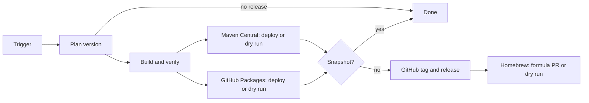

# Java CI/CD

Reusable Java workflows live in `.github/workflows/` and are pinned by a full commit SHA. They use POSIX `sh`.



The build receives one resolved version, sets it only in its workspace, and uses the commit timestamp for reproducible output. It never reads `project.version` to decide a release.

## Full GitHub + Maven + Homebrew release

Replace `my-tool` and `YunaBraska/homebrew-tap`. Omit the Homebrew job when the repository has no formula.

```yml
on:
  workflow_dispatch:
    inputs:
      homebrew:
        description: Homebrew.
        required: true
        default: true
        type: boolean

jobs:
  release:
    permissions:
      actions: read
      contents: write
      deployments: write
      packages: write
    uses: YunaBraska/YunaBraska/.github/workflows/wc_java_release.yml@f3ced49a6c7188d86778f332998af4049b141524
    with:
      maven_central: true
      github_packages: true
      release_strategy: release # snapshot | rc | release
      version_source: date # date | upstream
    secrets:
      CENTRAL_USER: ${{ secrets.CENTRAL_USER }}
      CENTRAL_PASS: ${{ secrets.CENTRAL_PASS }}
      GPG_SIGNING_KEY: ${{ secrets.GPG_SIGNING_KEY }}
      GPG_PASSPHRASE: ${{ secrets.GPG_PASSPHRASE }}

  homebrew:
    needs: release
    if: needs.release.outputs.upload_artifact == 'true' && !endsWith(needs.release.outputs.version, '-SNAPSHOT')
    permissions:
      contents: read
    uses: YunaBraska/YunaBraska/.github/workflows/wc_java_publish_homebrew.yml@f3ced49a6c7188d86778f332998af4049b141524
    with:
      formula_path: Formula/my-tool.rb
      tap_repository: YunaBraska/homebrew-tap
      version: ${{ needs.release.outputs.version }}
      asset_name: my-tool-${{ needs.release.outputs.version }}.jar
      dry_run: ${{ inputs.homebrew != true }}
    secrets:
      HOMEBREW_TAP_TOKEN: ${{ secrets.HOMEBREW_TAP_TOKEN }}
```

Homebrew is deliberately a separate final job: its formula, tap, and release asset are repository-specific. It receives the release version from the same workflow output. Uncheck `homebrew` to validate the formula without opening a tap pull request.

| Source / strategy | Version | Tag and release |
| --- | --- | --- |
| `date` / `snapshot` | `YYYY.MM.DD-SNAPSHOT` | No |
| `date` / `release` | `YYYY.MM.DD` | On `pom.xml` or `src` change, or `force` |
| `upstream` / `snapshot`, `rc`, `release` | Semver action result | Snapshot: no; otherwise: yes |

`maven_central` and `github_packages` default to `true`. Set either to `false` to run its job as a dry run; build, validation, and the other publisher still run. Maven Central publishing is allowed only from `main`. GitHub Packages is an artifact publisher; GitHub tag/release is always real for non-snapshots and has no dry-run switch.

Any GitHub release version containing `-` is a pre-release (`-rc`, `-beta`, `-alpha`, `-SNAPSHOT`, and similar). A stable version is Latest.

## Building blocks

| Workflow | Purpose |
| --- | --- |
| `wc_java_build_common.yml` | Build, test, set a supplied version, optionally upload `build-workspace`. Outputs `commit_sha` and `version`. |
| `wc_java_publish_central.yml` | Download `build-workspace`; validate or deploy to Maven Central. |
| `wc_java_publish_github_packages.yml` | Download `build-workspace`; package or deploy to GitHub Packages. |
| `wc_java_create_github_release.yml` | Download `build-workspace`; create/update the GitHub release and upload its assets. |
| `wc_java_publish_homebrew.yml` | Download a release asset, update a formula, and open a pull request in the tap. |

The three artifact consumers accept an optional `run_id` when called independently. Use the release workflow for the normal path; it connects the build artifact automatically.
