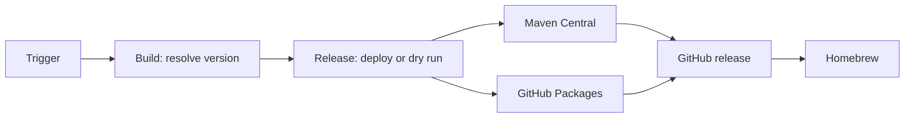

# Java CI/CD

Reusable Java workflows use POSIX `sh`. External calls use a full commit SHA; an internal call uses `./.github/workflows/` at the same commit.



Build resolves one version, writes it only to its workspace POM, and tests it. It never reads `project.version` to decide a release.

## Full GitHub + Maven + Homebrew release

Replace `my-tool` and `YunaBraska/homebrew-tap`. Omit any publisher the repository does not use.

```yml
on:
  workflow_dispatch:
    inputs:
      maven_central:
        description: Maven Central.
        required: true
        default: true
        type: boolean
      github_packages:
        description: GitHub Packages.
        required: true
        default: true
        type: boolean
      homebrew:
        description: Homebrew.
        required: true
        default: true
        type: boolean
      force:
        description: Force.
        required: true
        default: false
        type: boolean

# yuna-java-release: true
name: 🏷️ CD · Release

jobs:
  release:
    permissions:
      contents: read
    uses: YunaBraska/YunaBraska/.github/workflows/wc_java_release.yml@b317778e8353eecddc671bd4afbedd0fa659f990
    with:
      force: ${{ inputs.force }}

  central:
    needs: release
    if: ${{ always() && !cancelled() && needs.release.result == 'success' }}
    permissions:
      actions: read
      contents: read
      deployments: write
    uses: YunaBraska/YunaBraska/.github/workflows/wc_java_publish_central.yml@b317778e8353eecddc671bd4afbedd0fa659f990
    with:
      dry_run: ${{ inputs.maven_central != true || needs.release.outputs.dry_run == 'true' }}
    secrets:
      CENTRAL_USER: ${{ secrets.CENTRAL_USER }}
      CENTRAL_PASS: ${{ secrets.CENTRAL_PASS }}
      GPG_SIGNING_KEY: ${{ secrets.GPG_SIGNING_KEY }}
      GPG_PASSPHRASE: ${{ secrets.GPG_PASSPHRASE }}

  packages:
    needs: release
    if: ${{ always() && !cancelled() && needs.release.result == 'success' }}
    permissions:
      actions: read
      contents: read
      deployments: write
      packages: write
    uses: YunaBraska/YunaBraska/.github/workflows/wc_java_publish_github_packages.yml@b317778e8353eecddc671bd4afbedd0fa659f990
    with:
      dry_run: ${{ inputs.github_packages != true || needs.release.outputs.dry_run == 'true' }}

  github:
    needs: [release, central, packages]
    if: ${{ always() && !cancelled() && needs.release.outputs.dry_run == 'false' && !endsWith(needs.release.outputs.version, '-SNAPSHOT') && needs.release.result == 'success' && needs.central.result == 'success' && needs.packages.result == 'success' }}
    permissions:
      actions: read
      contents: write
    uses: YunaBraska/YunaBraska/.github/workflows/wc_java_create_github_release.yml@b317778e8353eecddc671bd4afbedd0fa659f990
    with:
      commit_sha: ${{ needs.release.outputs.commit_sha }}
      version: ${{ needs.release.outputs.version }}

  homebrew:
    needs: [release, github]
    if: ${{ needs.github.result == 'success' }}
    permissions:
      contents: read
    uses: YunaBraska/YunaBraska/.github/workflows/wc_java_publish_homebrew.yml@b317778e8353eecddc671bd4afbedd0fa659f990
    with:
      formula_path: Formula/my-tool.rb
      tap_repository: YunaBraska/homebrew-tap
      version: ${{ needs.release.outputs.version }}
      asset_name: my-tool-${{ needs.release.outputs.version }}.jar
      dry_run: ${{ inputs.homebrew != true }}
    secrets:
      HOMEBREW_TAP_TOKEN: ${{ secrets.HOMEBREW_TAP_TOKEN }}
```

## Version resolution

| Source / Semver strategy | Version |
| --- | --- |
| no `upstream_version` / empty | Commit date: `YYYY.M.D` |
| `upstream_version` / empty | Exact upstream version |
| either / `snapshot`, `rc`, `major`, `minor`, `patch` | Semver action’s matching `next_<strategy>` |

Common build defaults to `snapshot`. The Semver base is the highest valid upstream version or tag; with neither it is `0.0.0`, so the first snapshot is `0.0.1-SNAPSHOT`.

`false` selects a publisher dry run; build and artifact-publisher validation still run. An unchanged release or non-default branch also uses dry runs. GitHub releases are real and created only for a new non-snapshot version. Homebrew validation needs that GitHub release asset and opens a `bot/maintenance-homebrew-<repository>-<version>` tap PR; the next weekly run merges it when green.

A GitHub version with a hyphen is a pre-release.

Weekly release discovery requires exactly one `# yuna-java-release: true` marker.

## Building blocks

| Workflow | Purpose |
| --- | --- |
| `wc_java_build_common.yml` | Resolve, build, test, and optionally upload `build-workspace`. |
| `wc_java_release.yml` | Build and decide deploy versus dry run. Outputs `commit_sha`, `dry_run`, and `version`. |
| `wc_java_publish_central.yml` | Validate or deploy the build workspace to Maven Central. |
| `wc_java_publish_github_packages.yml` | Validate or deploy the build workspace to GitHub Packages. |
| `wc_java_create_github_release.yml` | Create/update a GitHub release and upload its assets. |
| `wc_java_publish_homebrew.yml` | Download a release asset, update a formula, and open a tap PR. |
