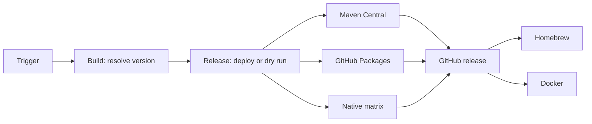

# Java CI/CD

Reusable Java workflows use POSIX `sh`. External calls use a full commit SHA; an internal call uses `./.github/workflows/` at the same commit.



Build resolves one version, writes it only to its workspace POM, and tests it. With `dry_run: true`, it resolves `next_snapshot`. It never reads `project.version` to decide a release. Date versions use UTC.

## POM migration baseline

- Use `<version>1.0.0</version>` and define `project.build.outputTimestamp`.
- Keep version properties in one block, grouped as project, test, and build.
- Set `maven-jar-plugin` `outputTimestamp` from that property; the build replaces it with the commit timestamp.
- Use `maven-compiler-plugin` `<release>`, not `<source>` / `<target>`.
- Attach source and Javadoc jars in the normal build.
- Keep profile `central` for GPG and `central-publishing-maven-plugin`, with `autoPublish` and `waitUntil` set to `published`.

## Migration

1. Create one CI-only PR from the POM baseline and the four standard workflows: pull request, snapshot, release, and maintenance.
2. Add Central and GitHub Packages. Add Homebrew, native, or Docker only when the project ships them. Keep every provider call on the same full commit SHA.
3. Run the PR build, squash merge it, and verify the real snapshot jobs in Central and GitHub Packages. Native projects also verify their one-day matrix artifacts.
4. Dispatch one forced stable release only when a new UTC date version is available. Verify Central, Packages, tag, GitHub Release, JAR, sources, Javadocs, and every enabled native asset or image.

Replace `<FULL_COMMIT_SHA>` below with one full immutable commit SHA from `YunaBraska/YunaBraska`.

## Full GitHub + Maven + Homebrew release

Replace `my-tool` and `YunaBraska/homebrew-tap`. Omit any publisher the repository does not use.

```yml
on:
  workflow_dispatch:
    inputs:
      maven_central:
        description: Maven Central.
        required: true
        default: true
        type: boolean
      github_packages:
        description: GitHub Packages.
        required: true
        default: true
        type: boolean
      homebrew:
        description: Homebrew.
        required: true
        default: true
        type: boolean
      force:
        description: Force.
        required: true
        default: false
        type: boolean

# yuna-release: true
name: 🏷️ CD · Release

jobs:
  release:
    permissions:
      contents: read
    uses: YunaBraska/YunaBraska/.github/workflows/wc_java_release.yml@<FULL_COMMIT_SHA>
    with:
      force: ${{ inputs.force }}
      dry_run: ${{ inputs.maven_central != true || inputs.github_packages != true || inputs.homebrew != true }}

  central:
    needs: release
    if: ${{ always() && !cancelled() && needs.release.result == 'success' }}
    permissions:
      actions: read
      contents: read
      deployments: write
    uses: YunaBraska/YunaBraska/.github/workflows/wc_java_publish_central.yml@<FULL_COMMIT_SHA>
    secrets:
      CENTRAL_USER: ${{ secrets.CENTRAL_USER }}
      CENTRAL_PASS: ${{ secrets.CENTRAL_PASS }}
      GPG_SIGNING_KEY: ${{ secrets.GPG_SIGNING_KEY }}
      GPG_PASSPHRASE: ${{ secrets.GPG_PASSPHRASE }}

  packages:
    needs: release
    if: ${{ always() && !cancelled() && needs.release.result == 'success' }}
    permissions:
      actions: read
      contents: read
      deployments: write
      packages: write
    uses: YunaBraska/YunaBraska/.github/workflows/wc_java_publish_github_packages.yml@<FULL_COMMIT_SHA>

  github:
    needs: [release, central, packages]
    if: ${{ always() && !cancelled() && needs.release.outputs.dry_run == 'false' && !endsWith(needs.release.outputs.version, '-SNAPSHOT') && needs.release.result == 'success' && needs.central.result == 'success' && needs.packages.result == 'success' }}
    permissions:
      actions: read
      contents: write
    uses: YunaBraska/YunaBraska/.github/workflows/wc_java_create_github_release.yml@<FULL_COMMIT_SHA>
    with:
      commit_sha: ${{ needs.release.outputs.commit_sha }}
      version: ${{ needs.release.outputs.version }}

  homebrew:
    needs: [release, github]
    if: ${{ always() && !cancelled() && needs.release.result == 'success' && (needs.github.result == 'success' || needs.release.outputs.dry_run == 'true') }}
    permissions:
      contents: read
    uses: YunaBraska/YunaBraska/.github/workflows/wc_java_publish_homebrew.yml@<FULL_COMMIT_SHA>
    with:
      formula_path: Formula/my-tool.rb
      tap_repository: YunaBraska/homebrew-tap
      version: ${{ needs.release.outputs.version }}
      asset_name: my-tool-${{ needs.release.outputs.version }}.jar
      dry_run: ${{ needs.release.outputs.dry_run == 'true' }}
    secrets:
      HOMEBREW_TAP_TOKEN: ${{ secrets.HOMEBREW_TAP_TOKEN }}
```

## Version resolution

| Source / Semver strategy | Version |
| --- | --- |
| no `upstream_version` / empty | UTC release date: `YYYY.M.D` |
| `upstream_version` / empty | Exact upstream version |
| either / `snapshot`, `rc`, `major`, `minor`, `patch` | Semver action’s matching `next_<strategy>` |

Common build defaults to `snapshot`. The Semver base is the latest tag or upstream version; with neither it is `0.0.1`.

A date that is not newer than the latest tag resolves `next_snapshot`; it cannot create a lower stable Maven version.

Disabling an artifact publisher selects a dry run. Build resolves a snapshot; Central and GitHub Packages deploy that snapshot. Homebrew audits its formula without an update. An unchanged release or non-default branch also uses dry runs unless `force` is true. GitHub releases are real and created only for a new non-snapshot version. A release opens a `bot/maintenance-homebrew-<repository>-<version>` tap PR; the next weekly run merges it when green.

A GitHub version with a hyphen is a pre-release.

Weekly release discovery requires exactly one `# yuna-release: true` marker and a `workflow_dispatch` trigger with defaults. Maintenance merges green `dependabot/*` and `bot/maintenance-*` PRs on Monday morning; release dispatch checks release inputs on Monday evening.

## Maven Wrapper

Dependabot does not support Maven Wrapper files. Run this weekly workflow; it opens a tested `bot/maintenance-*` PR, which weekly maintenance merges when green.

```yml
name: 🛠️ CI · Maintenance

on:
  schedule:
    - cron: '0 6 * * 0'
  workflow_dispatch:
    inputs:
      dry_run:
        description: Dry run.
        required: true
        default: true
        type: boolean

permissions: {}

jobs:
  maven_wrapper:
    permissions:
      actions: write
      contents: write
      pull-requests: write
    uses: YunaBraska/YunaBraska/.github/workflows/wc_java_update_maven_wrapper.yml@<FULL_COMMIT_SHA>
    with:
      dry_run: ${{ github.event_name == 'workflow_dispatch' && inputs.dry_run || false }}
```

## Building blocks

| Workflow | Purpose |
| --- | --- |
| `wc_java_build_common.yml` | Resolve, build, test, and optionally upload `build-workspace`. |
| `wc_java_release.yml` | Build and decide deploy versus dry run. Outputs `commit_sha`, `dry_run`, and `version`. |
| `wc_java_publish_central.yml` | Deploy the build workspace to Maven Central. |
| `wc_java_publish_github_packages.yml` | Deploy the build workspace to GitHub Packages. |
| `wc_java_create_github_release.yml` | Create/update a GitHub release and upload its assets. |
| `wc_java_publish_homebrew.yml` | Download a release asset, update a formula, and open a tap PR. |
| `wc_java_build_native.yml` | Build Linux amd64/arm64, macOS arm64, and Windows x64 native assets from the resolved version. |
| `wc_java_publish_docker.yml` | Build and publish a versioned multi-platform GHCR image. |
| `wc_java_update_maven_wrapper.yml` | Update Maven Wrapper and open a maintenance PR. |

## Native

Native projects add `native` after the resolved Java build. Maven Central and GitHub Packages wait for it, so a native failure cannot leave a successful Maven release without a complete GitHub release. Snapshots keep the matrix outputs for one day; stable releases attach them to the GitHub release.

## Docker

Docker projects add `docker` after a stable GitHub release or after snapshot publishers. `wc_java_publish_docker.yml` builds the checked-out resolved version and pushes `ghcr.io/<owner>/<repository>:<version>` for every run. Versions with a hyphen—including snapshots—never move `latest`; a stable version also updates `latest`.
