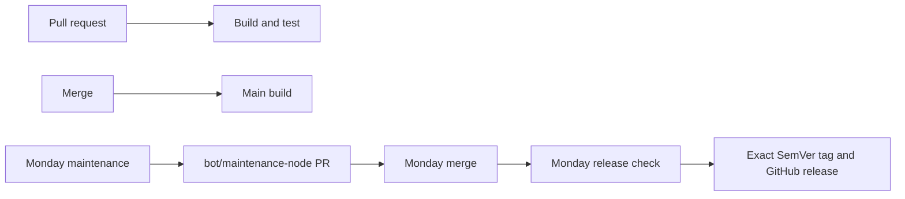

# Node CI/CD

Reusable Node workflows use POSIX `sh`, Node 24, full commit-SHA action pins, and
the same four repository workflows as Java: pull request, main build, release,
and maintenance.



## Decisions

- A GitHub Action releases from its committed `dist`; it does not publish to npm.
- The build runs `npm ci`, `npm test`, then rejects any tracked generated-file
  change. A release therefore always tags tested source and tested `dist`.
- Releases use the newest reachable full SemVer tag by creation time and
  Semver action's selected `next_<semver_strategy>`. Moving major aliases such
  as `3` are ignored. Tags are exact immutable SemVer versions.
- The weekly release dispatcher requires exactly one `# yuna-release: true`
  marker. It only dispatches when `action.yml`, `package.json`,
  `package-lock.json`, `src`, `dist`, or `licenses.csv` changed since the latest
  release.
- Dependabot maintains GitHub Action references. `bot/maintenance-node` owns npm
  updates because each dependency update must rebuild and commit `dist` in the
  same PR. Weekly maintenance merges either green Dependabot or maintenance PR.
- The legacy Node test and publish reusables are retired; every Node repository
  uses the four building blocks below.

## Repository workflows

Replace `<FULL_COMMIT_SHA>` with the immutable revision containing the reusable
workflows.

```yml
# build-pr.yml
name: 🧪 CI · Pull Request
on:
  pull_request:
    branches: [main]
    types: [opened, synchronize, reopened]
permissions: {}
jobs:
  build:
    permissions:
      contents: read
    uses: YunaBraska/YunaBraska/.github/workflows/wc_node_build_common.yml@<FULL_COMMIT_SHA>
```

```yml
# release.yml
# yuna-release: true
name: 🏷️ CD · Release
on:
  workflow_dispatch:
    inputs:
      semver_strategy:
        description: Version.
        required: true
        default: patch
        type: choice
        options: [patch, minor, major]
      force:
        description: Force.
        required: true
        default: false
        type: boolean
permissions: {}
jobs:
  release:
    permissions:
      contents: read
    uses: YunaBraska/YunaBraska/.github/workflows/wc_node_release.yml@<FULL_COMMIT_SHA>
    with:
      semver_strategy: ${{ inputs.semver_strategy }}
      force: ${{ inputs.force }}
  github:
    needs: release
    if: ${{ needs.release.outputs.release == 'true' }}
    permissions:
      contents: write
    uses: YunaBraska/YunaBraska/.github/workflows/wc_node_create_github_release.yml@<FULL_COMMIT_SHA>
    with:
      commit_sha: ${{ needs.release.outputs.commit_sha }}
      version: ${{ needs.release.outputs.version }}
```

```yml
# maintenance.yml
name: 🛠️ CI · Maintenance
on:
  schedule:
    - cron: '0 6 * * 0'
  workflow_dispatch:
    inputs:
      dry_run:
        description: Dry run.
        required: true
        default: true
        type: boolean
permissions: {}
jobs:
  node:
    permissions:
      actions: write
      contents: write
      pull-requests: write
    uses: YunaBraska/YunaBraska/.github/workflows/wc_node_update_dependencies.yml@<FULL_COMMIT_SHA>
    with:
      dry_run: ${{ github.event_name == 'workflow_dispatch' && inputs.dry_run || false }}
```

```yml
# dependabot.yml
version: 2
updates:
  - package-ecosystem: github-actions
    directory: /
    schedule:
      interval: weekly
```

## Building blocks

| Workflow | Purpose |
| --- | --- |
| `wc_node_build_common.yml` | Install, build, test, and verify committed generated output. |
| `wc_node_release.yml` | Resolve exact SemVer, decide whether production changed, and build. |
| `wc_node_create_github_release.yml` | Create the tag and GitHub release after a successful release decision. |
| `wc_node_update_dependencies.yml` | Update npm dependencies, regenerate `dist`, test, and open one maintenance PR. |
