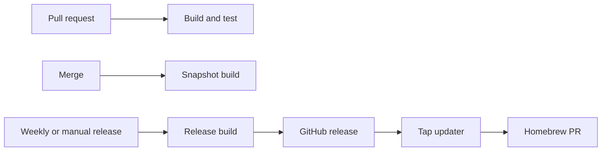

# Swift CI/CD



Every build checks out one commit, resolves one version, tests it, creates a universal macOS app, and writes `dist/<App>-<version>.zip` plus `dist/<App>-<version>.dmg`. The ZIP is the Homebrew asset; the DMG is the direct-install asset.

| Trigger | Version | Result |
| --- | --- | --- |
| Pull request or merge | `next_snapshot` from the latest tag, fallback `0.0.1` | Build only; merge keeps a one-day artifact. |
| Weekly release with source changes | UTC `YYYY.M.D` | Tag, GitHub release, ZIP and DMG. |
| Manual release | Same; `force` permits unchanged source | Same. |

Release detection ignores documentation, tests, examples, and `.github`. It releases for every other changed tracked file. A version with a hyphen is a GitHub pre-release.

## Reuse

```yaml
# build-pr.yml
permissions:
  contents: read

jobs:
  build:
    uses: YunaBraska/YunaBraska/.github/workflows/wc_swift_build_common.yml@<FULL_COMMIT_SHA>
    with:
      ref: ${{ github.event.pull_request.head.sha }}
    secrets: inherit
```

```yaml
# build-merge.yml
permissions:
  contents: read

jobs:
  build:
    uses: YunaBraska/YunaBraska/.github/workflows/wc_swift_build_common.yml@<FULL_COMMIT_SHA>
    with:
      ref: ${{ github.sha }}
      dry_run: true
      upload_artifact: true
    secrets: inherit
```

```yaml
# release.yml
# yuna-release: true
permissions:
  actions: read
  contents: write

jobs:
  release:
    uses: YunaBraska/YunaBraska/.github/workflows/wc_swift_release.yml@<FULL_COMMIT_SHA>
    with:
      force: ${{ inputs.force }}
    secrets: inherit
```

`scripts/check.sh` is the repository's test entrypoint. `scripts/package.sh "${VERSION}"` must create the ZIP and DMG in `dist/`. The common workflow deliberately has no packaging knobs.

## Signing

| Available secrets | Behavior | Reason |
| --- | --- | --- |
| None | Ad-hoc signature | The app has a valid local signature and remains testable before an Apple Developer membership exists. |
| `MACOS_SIGNING_CERTIFICATE`, `MACOS_SIGNING_CERTIFICATE_PASSWORD` | Developer ID signature with hardened runtime and timestamp | macOS can verify the publisher. |
| The certificate pair plus `MACOS_NOTARY_KEY`, `MACOS_NOTARY_KEY_ID`, `MACOS_NOTARY_ISSUER_ID` | Developer ID signature, notarized and stapled DMG | Gatekeeper accepts the app without the first-launch override. |

Certificate and notary values are base64-encoded secrets. Partial signing or notarization configuration fails safely; no unsigned release is produced. The runner deletes its temporary keychain and credential files after every build.

## Homebrew

The app repository never writes the tap. Add these two markers to its cask or formula:

```ruby
# yuna-release: YunaBraska/example
# yuna-release-asset: Example-{version}.zip
```

The tap's daily updater reads the latest stable GitHub release, verifies the asset checksum, and opens one `bot/maintenance-homebrew` PR. Weekly maintenance merges that green PR.
